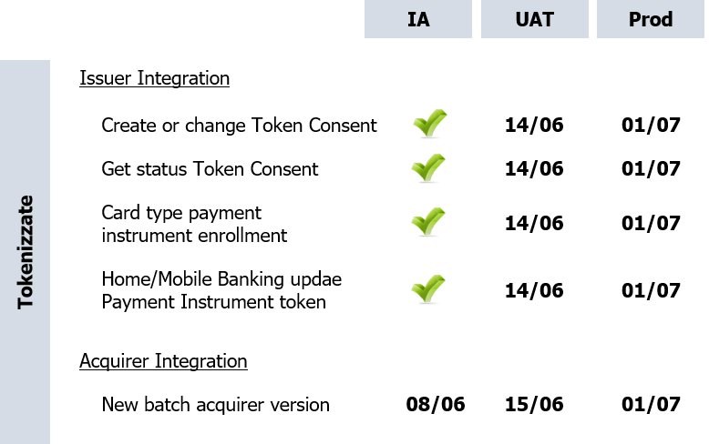

# Issuer Integration

## Roadmap
In the following image is synthesized the state of the art of Cashback Service.

The Interface Agreement (IA) will be published in this repository under the folder /ops resources/swagger in .yaml format.

In the following image is synthesized the roadmap for Tokenized Cards.

## FAQ & troubleshooting

### The user who has already subscribed to BPD from APP IO or another site/App provided by a certain Issuer, when accessing a site/app provided by another Issuer does he need to sign again the acceptance of T&C?
No, for the user who has already accepted the T&C of BPD, there will be no need to accept the T&C again when accessing any other app or site. 

### Will it be possible to visualize from H/M Banking, the cashback (or the percentage of the total cashback) generated exclusively from the card/cards issued by the same Issuer providing the H/M Banking website? 
No. From H/M Banking will be possible to visualize only the total amount of cashback accumulated by the user.

### Will the cashback be distributed to the winners every six months? 
Yes, BPD will calculate the cashback accumulated from each citizen and will send it to Consap. The cashback will be successively distributed by Consap to the winners at the end of each Award Period.

### If the user indicates the IBAN of the account where he wants to receive his Cashback on APP IO or on a site/app provided by a certain Issuer,  will he be able to visualize the IBAN information when accessing another app/site provided by another Issuer?
Yes, the information about the IBAN (if inserted) will be displayed when accessing from APP IO or H/M Bankings website.

### Will the user be able to visualize all payment instruments enabled to BPD from his H/M Banking?
No, the user will be able to visualize in his H/M Banking only the enrolled Payment Instruments which have been issued from the same Issuer providing the H/M Banking website.

### Will the user be able to deactivate BPD on a payment instrument from his H/M Banking if the same instrument has been enrolled to BPD from APP IO?
It will be possible to deactivate BPD from H/M Banking only if the Payment Instrument is issued from the same Issuer providing the H/M Banking website.
From APP IO it will be possible to deactivate BPD from every payment instrument regardless of their Issuer.

### If the user has not inserted an IBAN, will he receive his cashback? 
No, if the user at the end of the Award Period hasn't specified the IBAN of the account where he wants to receive his cashback, he won't be able to receive the accumulated cashback.

### If the user has inserted correctly the IBAN where he wants to receive his cashback, will he automatically receive the cashback at the end of the Award Period? 
Yes, if the IBAN was correctly inserted, in the predetermined month he will receive the accumulated cashback in the account.

### How is it going to be managed the half-yearly reimbursement if “Bonus Pagamenti Digitali” for the first year will start on December 1st and will end on Dec 2021?
Other than the Award Period that will last 6 months ( for example: Jan2021 - June 2021 ) there will be initially an “experimental period” in the first month starting the 1st of December and ending the last of December.

### Could the Issuers send the token of the cards for the ApplePay and GooglePay transactions (which are currently TBD)? 
The transactions that will be sent to CentroStella should include also the Apple/Google Pay transactions. These transactions must contain the tokenized PAN.

### Will be possible for an User to subscribe and complete the onboarding process to BPD from his H/M Banking, if he wants to insert the IBAN of an account opened with another Issuer?
The user could insert an IBAN from his H/M Banking only if it is associated to an account opened  with the same Issuer providing the H/M Banking website. However, if the Client wants to insert an IBAN related to another account, will be possible for the User to complete the Onboarding procedure from his H/M Banking, by skipping the "filling in IBAN" step. In this way, he could register correctly to BPD and in a later time, he could fill in the IBAN field by accessing APP IO or the H/M Banking website provided by the same Issuer he has opened the account with.

### Will be necessary to accept again the T&C in case the T&C are updated/modified?
No, there will be no need to accept again the T&C.

### Where can be found the instructions regarding the generation of certificates?
All the necessary information and instructions can be found in the following path: https://github.com/pagopa/issuer_integration in the document “Issuer Interface Agreement_v2.pdf” in the section "Appendice 1 - Autenticazione Issuer". 

### Where can be found the instructions regarding the generation of the subscription key?
All the necessary information and instructions can be found in the following path: https://github.com/pagopa/issuer_integration in the document “Issuer Interface Agreement_v2.pdf” in the section "Appendice 2 - Autorizzazione Servizi Issuer". In this section, it is described step by step the Issuer's Authorization procedure.

### Which are the mailing addresses where the certificates must be sent to?
The Signed Request Certificate can be generated using the client-certificate.cnf configuration template. To enable the authentication process, the certificates related to CAs in ".cer" format must be sent to the API publisher (mail to: TeamCentroStella@sia.eu)
Regarding the tests in the SIT environment, the client certificate can be self-signed and should be provided to the API's publisher in the ".cer" format (mail to: TeamCentroStella@sia.eu), while for other environments (es: UAT, PROD ) must be signed by the CA internal of PagoPA (mail to: security@pagopa.it)

### Where should be inserted the Subscription Key obtained after the registration to Azure Portal?
After completing the subscription, the Client can invoke the services by inserting the key obtained "Ocp-Apim-Subscription-Key" as a parameter in the request header.

### Will be possible to enroll also tokenized payment instruments?
Currently, there are not available the enrollment interfaces related to tokenized payment instruments. 

### Where can be found the UAT and PROD pgp public keys, necessary to perform the procedure of enrollment of cards?
The pgp keys can be found in the following path: https://github.com/pagopa/issuer_integration/tree/master/ops_resources/PGP%20key

### In the API of Enrolment of the card what data should be contained in the parameters: IssuerAbiCode and Channel, with a particular reference to the case of the Participant Issuers which issue cards and provide interfaces for their Clients, but the Principal Member is a different Bank?
The expected values in the "issuerAbiCode" and "channel" fields are the following:
  1. "IssuerAbiCode" - valued with the Principal's ABI code
  2. "channel" - contains the Issuer's ABI code which provides the interface to its own client. This field can therefore be filled in with the ABI code of the Participant Bank   or with the ABI code of the Principal Member based on which Issuer provides the interface. 
  
  For example:
  a. if the request (enrollment payment Instrument or Unsubscribe User) is coming from a Participant Issuer, in the field "channel" is expected to be received the Participant’s  ABI code (es. Bank B with ABI Code =2), while the "IssuerAbiCode" should correspond to the Principal's ABI Code (Bank A with ABI code= 1)
  b. if the request comes from a Principal Issuer we expect both parameters to contain the same code (ABI code = 1).
  
## FAQ & troubleshooting - TOKENIZED CARDS

### How the User could allow the use of his own Tokenized Cards?
The user could activate the Tokenized Card/s for BPD (and/or FA in the Future) by using the touch point of the Issuer App (or the AppIo). The details of the User approval will be saved in the Token Manager’s repository.
The Token Manager (TKM) module will expose a new microservice (API get user status tokenizzate) to retrieve the status of the approval for the use of the Tokenized Card/s to the other systems.
The Issuer App could invoke the API get user status tokenizzate to show the User’s approval for the activation of his own Tokenized Cards.
When the User approves for the use of his own Tokenized Card/s, gives a permit to the TKM to retrieve the PAR/TokenPAN pair (through the API patch payment instruments) in order to save them for the related Payment instruments.

### How to enroll a Tokenized Card?
Through the payment instrument enrolment API (PUT /bpd/hb/payment-instruments/card), it will be possible to enroll a Physical Card while sending both “TokenPanList” and “PAR” associated to the card. Both “PAR” and “TokenPanList” parameters will be optional, in order to allow the User to activate payment instruments if they have not been tokenized yet.
However, the presence of the “TokenPanList” is always constrained to the “PAR” valorization.  The TokenPAN received will be saved as children of the parent payment instrument (physical card) and will inherit the same enrolment date of the PAR (The PAR allows the link between TokenPans and the PAN of the parent physical card thanks to the unique and immutable relationship among PAN, TokenPAN and PAR).

### How to Update Payment Instruments Tokens?
A patch service will allow to update the tokens associated to a payment instrument (identified by the HPAN) which is already active on BPD.
The Issuer will sent all the PARs and all the active and valid tokens associated to the PAN at the time of the request. Centro Stella will save the new associations tokenPAN / PAR on the internal database and will logically delete the ones which are not present.
Please note that for the PARs that are already present in the BPD database, the first valid date of enrolment will not be updated/modified. All the sent tokens will acquire by default the PAR activation date as their enrolment date. If the patch request contains only the encrypted PAN this would been that the card doesn't have any valid tokens associated.

### How to deactivate Payment Instrument's Token?
In order to complete the life cycle of a card, regardless of whether it is tokenized or not, it was decided to include in the tokenized solutions, currently not available to Issuers. The service can be invoked by Home/Mobile Banking in order to cancel a payment instrument (pgp encrypted PAN). Deleting a parent card will have the immediate effect of disabling active services on the same and on all related tokens if present.
