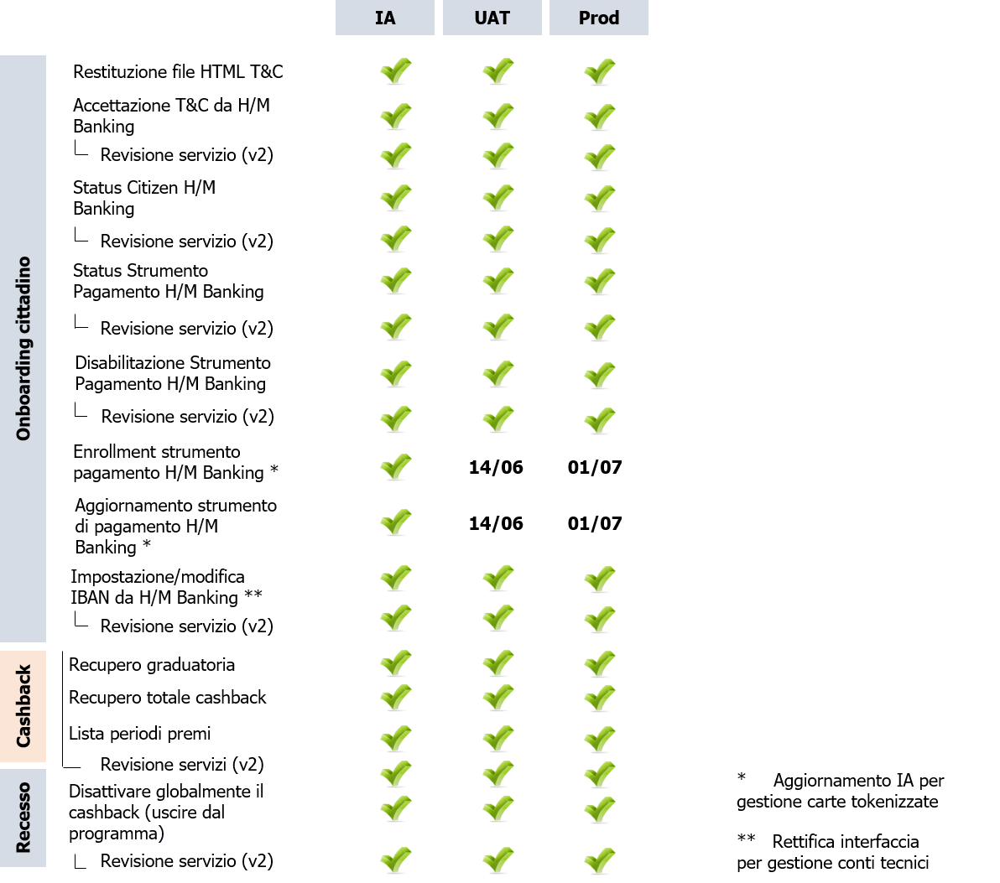

# Issuer Integration

## Roadmap
In the following image is synthesized our current roadmap.

The Interface Agreement (IA) will be published in this repository under the folder /ops resources/swagger in .yaml format.

## Joining the BETA  program

Starting from Tuesday 17/11 will be possible to join the Beta program in order to verify the Cashback features through the use of APP IO.

#### How to join the program
1. Please read the documents ("Informativa survey beta testing.docx", "Beta Test_NDA_long form_IT.docx") that can be found in the following path: /https://github.com/pagopa/issuer_integration/tree/master/ops_resources/PILOTA
2. Compile properly the document "Beta Test_NDA_long form_IT.docx" and send it to the mailing address: teamCentroStella@sia.eu (fill in the parts highlighted in yellow)
3. Please read the privacy policy for BANCOMAT and send an e-mail to teamCentroStella@sia.eu confirming your willingness to participate in the “pilot” (https://github.com/pagopa/issuer_integration/tree/master/ops_resources/PILOTA)
4. Collect and provide the information required regarding the Issuers that will participate in the initiative, by filling in the Excel "Lista partecipanti al pilota" and send it to: teamCentroStella@sia.eu

Once these steps have been completed, you will receive an invitation to participate in the test program with the appropriate instructions according to the operating system that has been indicated in the request to join the pilot.

#### Credit card registration and transaction’s verification procedures
Once the application is installed, we ask you to proceed with the registration of one or more Cards and join the "Bonus Pagamenti Digitali" program.
From the 17/11 moment on, it will be possible to make payments on shop/stores in the national territory and check a few days later, that the transaction appears correctly in the APP IO’s dedicated section with its associated cashback (the rule is not definitive).

#### APP IO
Below will be listed some useful information for using APP IO:
- Registration of payment instruments:  can be done starting from the "Portafoglio" section, by clicking the "Aggiungi" button in the "Metodi di Pagamento" section.
- Subscription to the BPD: Can be done from the " Portafoglio" section, by clicking the "Aggiungi" button in the "Bonus e sconti" section.
- It is possible to access the cashback detail from the " Portafoglio" section, by entering the "Cashback" section. In this section, the following information is available:
a. Total cashback accumulated in the period and number of valid transactions
b. Payment methods, with relative activation / deactivation status
c. Transactions details
d. BPD service withdrawal option

#### Errors reporting
In the event of a potential error detected and / or failure to view a transaction, you can open an “issue” by clicking on the question mark icon at the top right of every page and then click on the "Segnala un Bug" button.
To discriminate and give priority to your reports, please report, in the body of the message, the “TEST_INTERNO_BPD” tag.

#### Points of attention
We kindly ask you to pay attention to the following notes:

- Keep the POS printout. In the event of an error or failure to view the transactions, it will be useful to make the necessary check on that specific transaction
- Make payments with cards of international circuits and / or ATM and do not use Apple Pay or Google PAY. These services are not enabled yet, so it will not be possible to elaborate transactions made via Apple/Google Pay
- We remind you that the transactions are displayed in APP IO after a few days based on the accounting date/time of the transaction. We ask you not to open a report immediately if the transaction is not displayed in the APP IO the next day.
- Please note that it is possible that a transaction may not be sent to CentroStella and therefore will not be displayed in APP IO, if a Merchant has an agreement with an Acquirer who has not joined the pilot in the production environment yet.

## FAQ & troubleshooting

### The user who has already subscribed to BPD from APP IO or another site/App provided by a certain Issuer, when accessing a site/app provided by another Issuer does he need to sign again the acceptance of T&C?
No, for the user who has already accepted the T&C of BPD, there will be no need to accept the T&C again when accessing any other app or site. 

### Will it be possible to visualize from H/M Banking, the cashback (or the percentage of the total cashback) generated exclusively from the card/cards issued by the same Issuer providing the H/M Banking website? 
No. From H/M Banking will be possible to visualize only the total amount of cashback accumulated by the user.

### Will the cashback be distributed to the winners every six months? 
Yes, BPD will calculate the cashback accumulated from each citizen and will send it to Consap. The cashback will be successively distributed by Consap to the winners at the end of each Award Period.

### If the user indicates the IBAN of the account where he wants to receive his Cashback on APP IO or on a site/app provided by a certain Issuer,  will he be able to visualize the IBAN information when accessing another app/site provided by another Issuer?
Yes, the information about the IBAN (if inserted) will be displayed when accessing from APP IO or H/M Bankings website.

### Will the user be able to visualize all payment instruments enabled to BPD from his H/M Banking?
No, the user will be able to visualize in his H/M Banking only the enrolled Payment Instruments which have been issued from the same Issuer providing the H/M Banking website.

### Will the user be able to deactivate BPD on a payment instrument from his H/M Banking if the same instrument has been enrolled to BPD from APP IO?
It will be possible to deactivate BPD from H/M Banking only if the Payment Instrument is issued from the same Issuer providing the H/M Banking website.
From APP IO it will be possible to deactivate BPD from every payment instrument regardless of their Issuer.

### If the user has not inserted an IBAN, will he receive his cashback? 
No, if the user at the end of the Award Period hasn't specified the IBAN of the account where he wants to receive his cashback, he won't be able to receive the accumulated cashback.

### If the user has inserted correctly the IBAN where he wants to receive his cashback, will he automatically receive the cashback at the end of the Award Period? 
Yes, if the IBAN was correctly inserted, in the predetermined month he will receive the accumulated cashback in the account.

### How is it going to be managed the half-yearly reimbursement if “Bonus Pagamenti Digitali” for the first year will start on December 1st and will end on Dec 2021?
Other than the Award Period that will last 6 months ( for example: Jan2021 - June 2021 ) there will be initially an “experimental period” in the first month starting the 1st of December and ending the last of December.

### Could the Issuers send the token of the cards for the ApplePay and GooglePay transactions (which are currently TBD)? 
The transactions that will be sent to CentroStella should include also the Apple/Google Pay transactions. These transactions must contain the tokenized PAN.

### Will be possible for an User to subscribe and complete the onboarding process to BPD from his H/M Banking, if he wants to insert the IBAN of an account opened with another Issuer?
The user could insert an IBAN from his H/M Banking only if it is associated to an account opened  with the same Issuer providing the H/M Banking website. However, if the Client wants to insert an IBAN related to another account, will be possible for the User to complete the Onboarding procedure from his H/M Banking, by skipping the "filling in IBAN" step. In this way, he could register correctly to BPD and in a later time, he could fill in the IBAN field by accessing APP IO or the H/M Banking website provided by the same Issuer he has opened the account with.

### Will be necessary to accept again the T&C in case the T&C are updated/modified?
No, there will be no need to accept again the T&C.

### Where can be found the instructions regarding the generation of certificates?
All the necessary information and instructions can be found in the following path: https://github.com/pagopa/issuer_integration in the document “Issuer Interface Agreement_v2.pdf” in the section "Appendice 1 - Autenticazione Issuer". 

### Where can be found the instructions regarding the generation of the subscription key?
All the necessary information and instructions can be found in the following path: https://github.com/pagopa/issuer_integration in the document “Issuer Interface Agreement_v2.pdf” in the section "Appendice 2 - Autorizzazione Servizi Issuer". In this section, it is described step by step the Issuer's Authorization procedure.

### Which are the mailing addresses where the certificates must be sent to?
The Signed Request Certificate can be generated using the client-certificate.cnf configuration template. To enable the authentication process, the certificates related to CAs in ".cer" format must be sent to the API publisher (mail to: TeamCentroStella@sia.eu)
Regarding the tests in the SIT environment, the client certificate can be self-signed and should be provided to the API's publisher in the ".cer" format (mail to: TeamCentroStella@sia.eu), while for other environments (es: UAT, PROD ) must be signed by the CA internal of PagoPA (mail to: security@pagopa.it)

### Where should be inserted the Subscription Key obtained after the registration to Azure Portal?
After completing the subscription, the Client can invoke the services by inserting the key obtained "Ocp-Apim-Subscription-Key" as a parameter in the request header.

### Will be possible to enroll also tokenized payment instruments?
Currently, there are not available the enrollment interfaces related to tokenized payment instruments. 

### Where can be found the UAT pgp public key, necessary to perform the procedure of enrollment of cards?
The pgp key can be found in the following path: https://github.com/pagopa/issuer_integration/tree/master/ops_resources/PGP%20key
